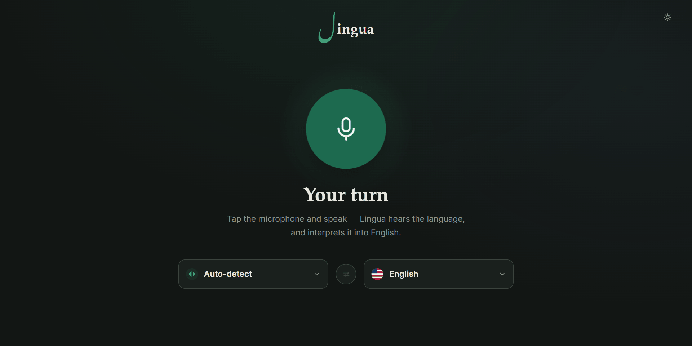
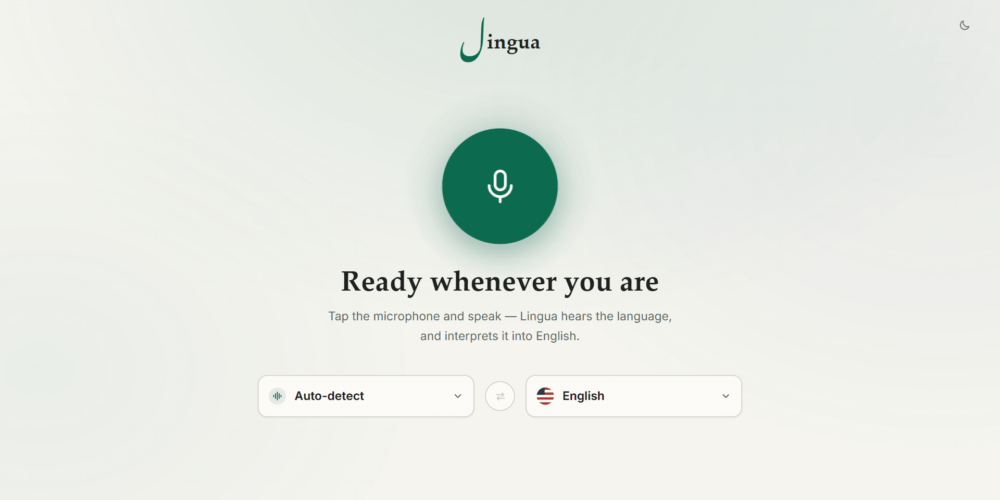
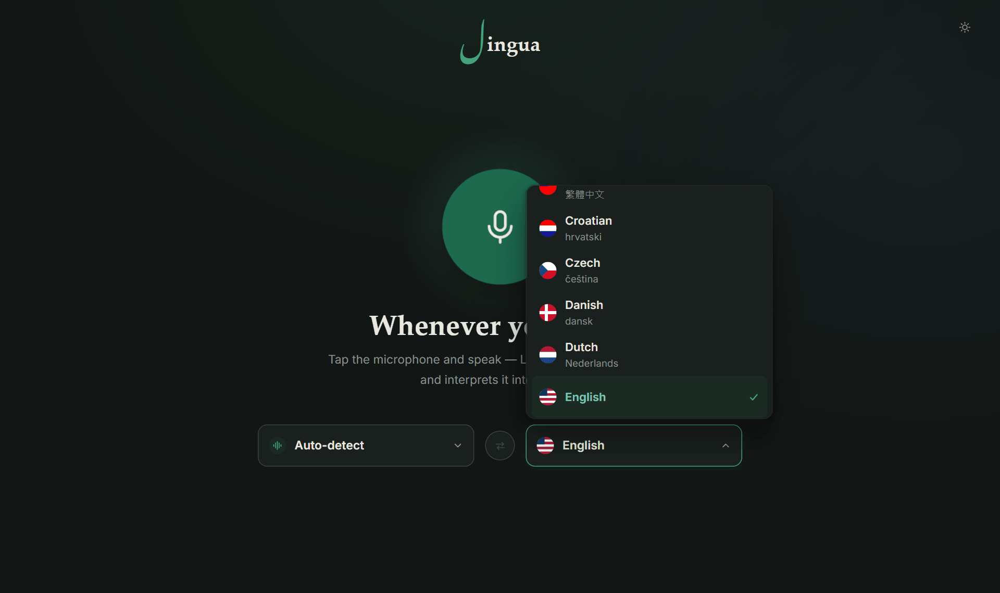
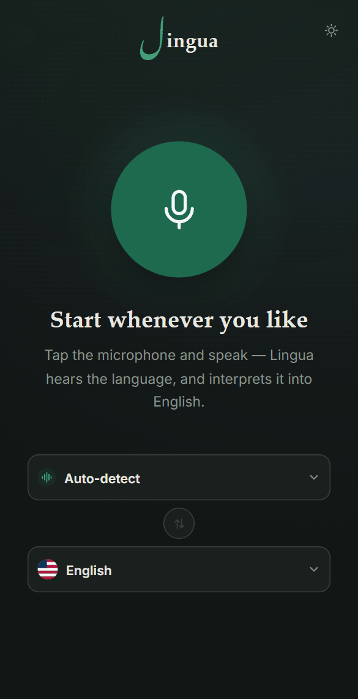

<div align="center">

# Lingua

**Translation tells you what someone said. Lingua helps you understand what happens next.**

CTP Hacks 2026 — Winner, Best SWE Practices

[**Try the live demo →**](https://try-lingua.vercel.app)

[](https://github.com/smahmood-data/Lingua/actions/workflows/ci.yml)
[](LICENSE)
[](frontend/src/types.ts)



</div>

---

## What it is

Lingua is a real-time voice interpreter for the conversations where misunderstanding is expensive — with a school, a doctor, a landlord, a bank, or a government office.

Put one phone or laptop between two people. Lingua detects the spoken language automatically, translates it, speaks the translation aloud, and shows both sides as live subtitles. Neither person has to pick their own language, tap to switch turns, or know how the app works.

It is built on Gemini Live Translate, and the long-lived API key never reaches the browser.

## Status

This started as a hackathon project and is still an MVP. What is and is not built:

| Capability | Status |
| --- | --- |
| Automatic spoken-language detection | ✅ Working |
| Live translation into 79 target languages, spoken aloud | ✅ Working |
| Live bilingual subtitles with per-turn language labels | ✅ Working |
| Secure ephemeral-token exchange; key never in the browser | ✅ Working |
| Per-IP abuse protection and idle-session cleanup | ✅ Working |
| Deployed and reachable | ✅ [try-lingua.vercel.app](https://try-lingua.vercel.app) |
| Structured end-of-conversation summary | 🚧 **In progress** — the summary backend/API and its evaluation harness already exist and are tested; the summary UI is still not shipped on `main` and is being implemented in [PR #47](https://github.com/smahmood-data/Lingua/pull/47) ([#5](https://github.com/smahmood-data/Lingua/issues/5)) |
| Barge-in (talking over the translation) | ⚠️ **Implemented but disabled** — see [Known limitations](#known-limitations) ([#28](https://github.com/smahmood-data/Lingua/issues/28)) |
| Saved history, search, transcript export | 🚧 **In progress** — still not shipped on `main`; being implemented in [PR #47](https://github.com/smahmood-data/Lingua/pull/47) ([#36](https://github.com/smahmood-data/Lingua/issues/36), [#37](https://github.com/smahmood-data/Lingua/issues/37)) |
| Accounts, storage, call integrations | ❌ Deliberately out of scope |

## Screens

<table>
<tr>
<td width="50%"></td>
<td width="50%"></td>
</tr>
<tr>
<td align="center"><em>Light and dark themes follow the system setting</em></td>
<td align="center"><em>79 target languages, each with its native name</em></td>
</tr>
</table>

<div align="center">

<br><em>The layout is built for a phone laid on a desk between two people</em>
</div>

## Try it

The fastest path is the [live demo](https://try-lingua.vercel.app) — allow microphone access and speak.

To run it locally you need Node.js 20.19+ (24.x for the frontend), npm, and a [Gemini API key](https://aistudio.google.com/apikey).

```bash
git clone https://github.com/smahmood-data/Lingua.git
cd Lingua
```

**Terminal 1 — backend**

```bash
cd backend
npm ci
cp .env.example .env    # then set GEMINI_API_KEY
npm run dev
```

**Terminal 2 — frontend**

```bash
cd frontend
npm ci
npm run dev
```

Open the printed URL. Never put the key in a `VITE_*` variable — it would be compiled into the browser bundle.

## How it works

```text
Browser (React + Vite)
  ├─ local /api/* → Vite proxy → backend/ (Express)
  │    ├─ GET  /api/live-token
  │    └─ POST /api/summarize
  └─ Vercel GET /api/live-token → frontend/api/live-token.ts
```

The browser never sees the long-lived Gemini key. It asks the server for a short-lived Live API token that is locked to one session, one model, and the audio-translation configuration, and expires quickly. Audio streams directly from the browser to Gemini over that constrained token; transcript summaries are schema-validated server-side.

[`docs/ARCHITECTURE.md`](docs/ARCHITECTURE.md) has the full request, session, and playback diagrams.

## Worth a look

If you are reading the source, these are the parts with real problems in them:

- **[`lib/translation/conversation.ts`](frontend/src/lib/translation/conversation.ts)** — turn ownership between two concurrent Live routes. Gemini marks speech `finished` up to a second before a person has actually stopped talking, so a naive implementation splits one sentence into several turns. The coordinator resolves that with a join window and an idle-release timeout.
- **[`lib/translation/audio/echoGate.ts`](frontend/src/lib/translation/audio/echoGate.ts)** — deciding whether the microphone is hearing a person or the app's own speakers, using a relative rather than fixed threshold. The file is candid about the case it cannot solve. It is currently disabled; see below.
- **[`lib/translation/config.ts`](frontend/src/lib/translation/config.ts)** — nearly every constant is justified against behaviour observed in real captured sessions rather than guessed.
- **[`traceRegression.test.ts`](frontend/src/lib/translation/traceRegression.test.ts) / [`traceReplay.test.ts`](frontend/src/lib/translation/traceReplay.test.ts)** — recorded real sessions replayed against the coordinator, so fixed bugs stay fixed. The fixtures store event metadata only, never conversation text.
- **[`eval/`](eval)** — a reproducible scored benchmark for summary extraction, so that feature can be judged on numbers instead of vibes.
- **[`frontend/api/live-token.ts`](frontend/api/live-token.ts)** and **[`backend/src/server.ts`](backend/src/server.ts)** — the same token contract implemented twice, for Vercel and for local Express, both fail-closed.

## Known limitations

Honest about what does not work well yet:

- **You cannot interrupt the translation.** Barge-in is fully implemented and unit-tested, but shipped disabled (`BARGE_IN_ENABLED = false`). In real recorded sessions the echo gate kept reading continued speech and speaker residue as an interruption, which committed half-finished turns and fed the remainder into the next one. A reliable interpreter that waits its turn was judged better than an interruptible one that garbles sentences. Doing it properly needs an acoustic echo-cancellation reference signal, not the loudness heuristic used now. The relevant tests are skipped in step with the flag, and are re-enabled by turning it back on.
- **No summary screen.** The extraction API and its evaluation harness are built and tested; nothing in the UI calls them yet.
- **Nothing is saved.** Closing the tab discards the conversation. There is no history, export, or sharing.
- **Auto-detect can mislabel a turn** when a speaker switches language mid-sentence or two people talk over each other ([#29](https://github.com/smahmood-data/Lingua/issues/29)).
- **The translated voice can change between turns** ([#34](https://github.com/smahmood-data/Lingua/issues/34)).
- **The rate limit is per-IP, not per-identity**, and Vercel Firewall counters are regional. It protects a demo; it is not a spending cap. See [`docs/SECURITY.md`](docs/SECURITY.md).

## Development

```bash
# frontend
cd frontend && npm run lint && npm test && npm run build

# backend
cd backend && npm run check && npm test && npm run build
```

Backend `npm test` runs the local HTTP contract tests. With a `GEMINI_API_KEY` set it also mints a real Live token. Set `RUN_GEMINI_SUMMARY_TESTS=true` only when you want the quota-consuming summary integration check.

## Documentation

| Document | Contents |
| --- | --- |
| [`docs/ARCHITECTURE.md`](docs/ARCHITECTURE.md) | System architecture, user journey, runtime sequences, summary flow |
| [`docs/SECURITY.md`](docs/SECURITY.md) | Key boundary, token constraints, abuse protection, and its limits |
| [`docs/DEPLOYMENT.md`](docs/DEPLOYMENT.md) | Vercel configuration, owner setup, smoke checks, failure map |
| [`docs/REPOSITORY_STRUCTURE.md`](docs/REPOSITORY_STRUCTURE.md) | Package ownership and local/Vercel request paths |
| [`docs/ROADMAP.md`](docs/ROADMAP.md) | What is built, what is next, and what is deliberately deferred |
| [`CONTRIBUTING.md`](CONTRIBUTING.md) | Branches, commits, pull requests, team workflow |
| [`AI_USAGE.md`](AI_USAGE.md) | Disclosure of AI-assisted work |

## Team

Built at CTP Hacks by four people:

| | |
| --- | --- |
| [**Adil Ahmed**](https://github.com/adillpickles) | Live audio pipeline and playback, translation session and turn coordination, interpreter UI, abuse protection, and deployment hardening ([#15](https://github.com/smahmood-data/Lingua/pull/15), [#16](https://github.com/smahmood-data/Lingua/pull/16), [#20](https://github.com/smahmood-data/Lingua/pull/20), [#22](https://github.com/smahmood-data/Lingua/pull/22), [#38](https://github.com/smahmood-data/Lingua/pull/38), [#40](https://github.com/smahmood-data/Lingua/pull/40), [#42](https://github.com/smahmood-data/Lingua/pull/42), [#43](https://github.com/smahmood-data/Lingua/pull/43), [#48](https://github.com/smahmood-data/Lingua/pull/48)) |
| [**Jamis Bade**](https://github.com/Jawmis) | Secure Gemini backend, ephemeral token service, structured summary API, and the scored summary evaluation benchmark ([#13](https://github.com/smahmood-data/Lingua/pull/13), [#26](https://github.com/smahmood-data/Lingua/pull/26)) |
| [**Emma Katz**](https://github.com/emmakatz06) | Interpreter screen, bilingual subtitles, status states, and keyboard navigation ([#14](https://github.com/smahmood-data/Lingua/pull/14)) |
| [**Syed Faisal Mahmood**](https://github.com/smahmood-data) | Repository owner and steward who took Lingua from a hackathon prototype to a live deployed application at [try-lingua.vercel.app](https://try-lingua.vercel.app). He scaffolded the project, keeps the deployment and Vercel project healthy, and has reviewed and merged a broad share of the team's work including [#13](https://github.com/smahmood-data/Lingua/pull/13), [#26](https://github.com/smahmood-data/Lingua/pull/26), [#40](https://github.com/smahmood-data/Lingua/pull/40), [#41](https://github.com/smahmood-data/Lingua/pull/41), [#43](https://github.com/smahmood-data/Lingua/pull/43), and [#48](https://github.com/smahmood-data/Lingua/pull/48). He also built the current transcript history, search, export, and on-demand summary flow in [PR #47](https://github.com/smahmood-data/Lingua/pull/47), continuing early work in [#19](https://github.com/smahmood-data/Lingua/pull/19). |

## Product principles

- Understanding is the goal; translation is the mechanism.
- Never invent a fact that was not in the conversation.
- Make uncertainty visible and ask for clarification instead of guessing.
- Stream audio; do not retain it.
- Keep the interface calm and legible under stress.

## License

[MIT](LICENSE).
