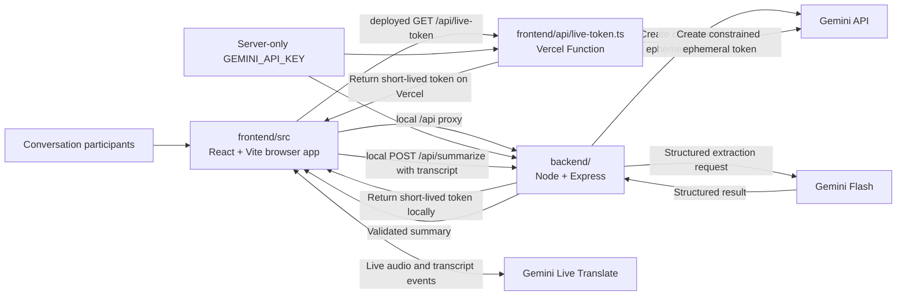
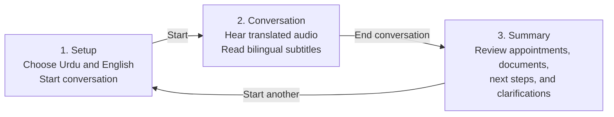
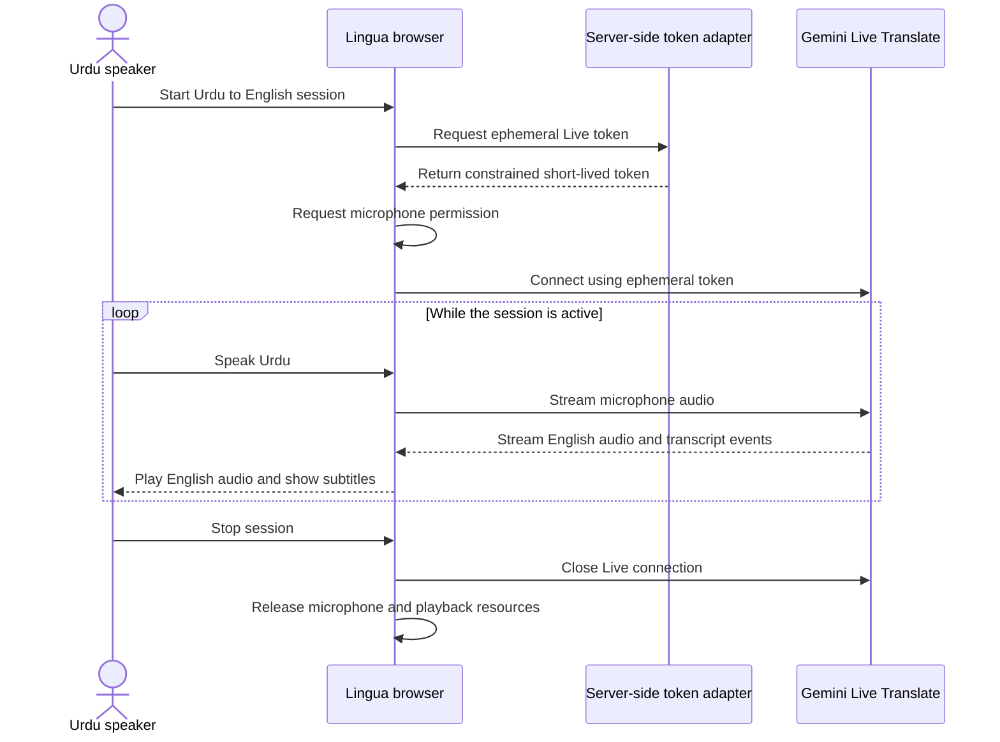
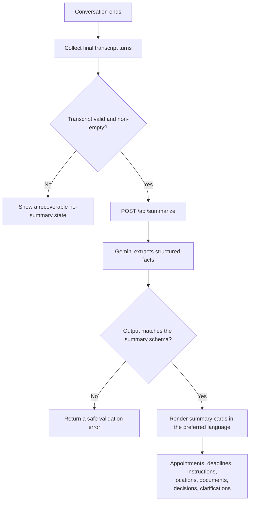
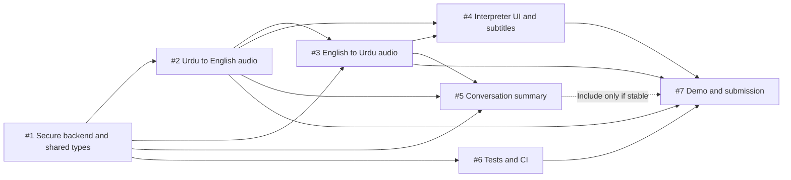

# Lingua Architecture and Flows

These diagrams describe the hackathon MVP: one laptop translates spoken Urdu and English in both directions, displays bilingual subtitles, and optionally produces a structured summary when the conversation ends.

## System architecture and secure token flow

The browser never receives the long-lived `GEMINI_API_KEY`. It asks a
server-side adapter for a constrained, short-lived token and uses that token for
the direct Live API connection. Local development and Vercel expose the same
browser path through different adapters; their ownership is documented in
[`REPOSITORY_STRUCTURE.md`](./REPOSITORY_STRUCTURE.md).

## Three-screen user journey

## Live translation sequence

The same sequence is reused with the languages reversed for English to Urdu.

## End-of-conversation summary flow

> **Build status.** The `POST /api/summarize` endpoint, its schema validation,
> and the scored benchmark in [`eval/`](../eval) are implemented and tested.
> Nothing in the UI calls the endpoint yet, so the "Render summary cards" step
> above describes the intended flow rather than shipped behaviour. Tracked in
> [#5](https://github.com/smahmood-data/Lingua/issues/5).

### Summary response contract

`POST /api/summarize` returns a validated object with these fields:

| Field | Type | Meaning |
| --- | --- | --- |
| `summary` | `string` | Short prose recap in the preferred language |
| `appointments` | `{ date, time, location, notes }[]` | The first three are `string \| null` when not mentioned |
| `deadlines` | `string[]` | Dates by which something must be done |
| `instructions` | `string[]` | What the person was told to do |
| `locations` | `string[]` | Places named in the conversation |
| `documents` | `string[]` | Paperwork the person must bring or provide |
| `decisions` | `string[]` | Decisions or agreements reached |
| `clarifications` | `string[]` | Points that were unclear and should be confirmed |
| `nextSteps` | `string[]` | Actions to take after the conversation |

Missing information yields an empty array, never a fabricated value. Output that
does not match the schema is rejected server-side rather than passed to the
client.

## Issue dependency map

Issues #2 and #4 can begin against mocks while #1 is in progress, but their final integration depends on the secure backend and shared contracts from #1.

