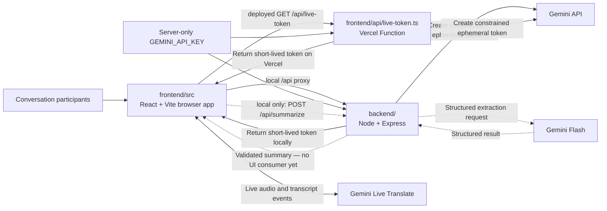
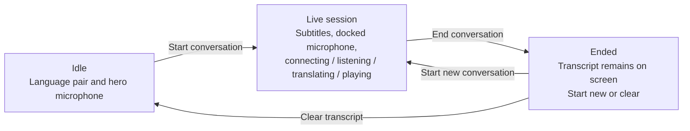
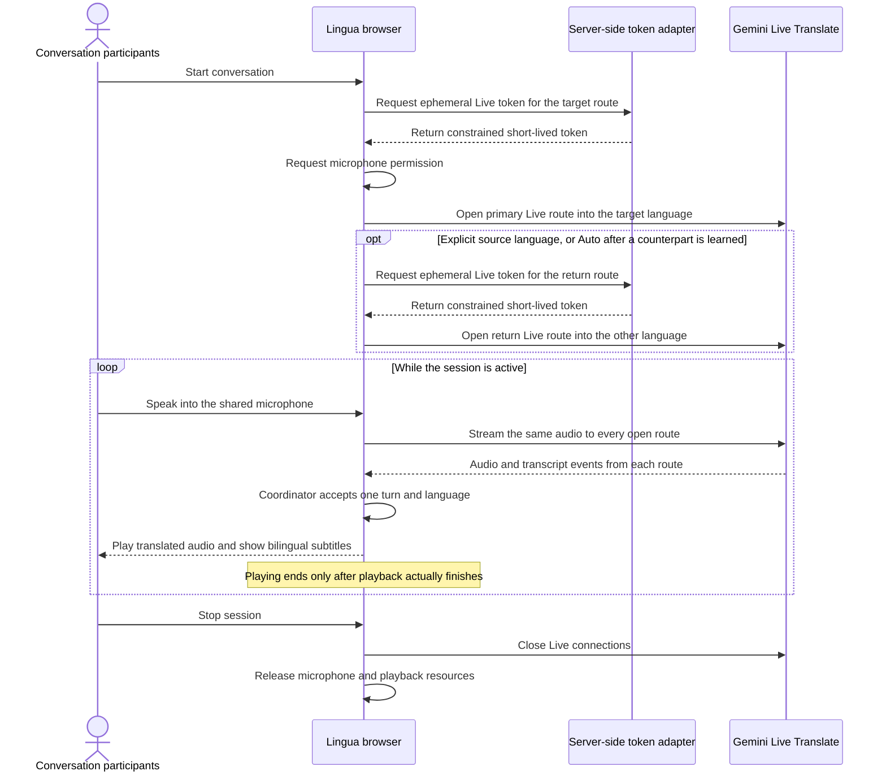
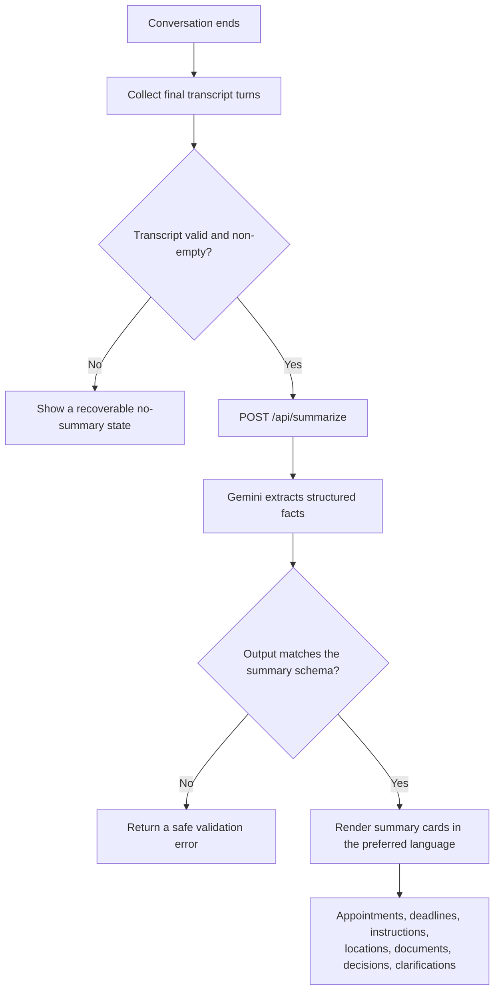

# Lingua Architecture and Flows

These diagrams describe the current live interpreter: one device translates
spoken language into any of 79 targets, plays the translation aloud, and shows
bilingual subtitles. Auto Detect can learn the other language of the pair;
users can also lock an explicit source and target.

The structured-summary path exists on the local Express backend and is
evaluated in [`eval/`](../eval). It is not wired into the product UI, and the
Vercel deployment does not serve it.

## System architecture and secure token flow

The browser never receives the long-lived `GEMINI_API_KEY`. It asks a
server-side adapter for a constrained, short-lived token and uses that token for
the direct Live API connection. Local development and Vercel expose the same
browser path through different adapters; their ownership is documented in
[`REPOSITORY_STRUCTURE.md`](./REPOSITORY_STRUCTURE.md).

Local Vite proxies `/api/*` to Express. Production Vercel serves only
`GET /api/live-token` from `frontend/api/live-token.ts`. `POST /api/summarize`
and `GET /api/health` stay on `backend/`.

## Interpreter canvas

The app is one canvas, not a three-screen setup → conversation → summary
wizard. `App.tsx` switches among three compositions of the same shell:

There is no summary screen. Ending a conversation leaves the in-memory
transcript visible until the user starts again or clears it. Closing the tab
discards it.

Session states a person watching the microphone would name:
`connecting`, `listening`, `translating`, `playing`, `stopped`, and `error`.
`translating` and `playing` are separate: only the second means speech is
coming out of the speakers.

## Live session internals

A Gemini Live Translate session has one `targetLanguageCode` and no source
field, so one socket can only ever render *into* one language. A two-person
conversation therefore uses two concurrent Live routes that both hear the same
microphone for the whole session. Neither is restarted between turns.

- **Primary route** — opened at session start; translates into the selected
  target language.
- **Return route** — translates into the other language. Opened immediately
  for an explicit pair. In Auto mode it opens when
  `ConversationCoordinator` adopts a counterpart language.

`TranslationSession` owns microphone capture, token requests, sockets,
playback, and the idle timeout. `liveTransport.ts` normalizes provider events
and does not decide turns. `ConversationCoordinator` is the authority for turn
ownership, accepted language, and what plays. `playbackScheduler` plays PCM16
and reports actual start and end, so Playing → Listening happens when speech
has finished — not when the model stops generating.

Both sockets always receive a continuous stream. While translated speech is
audible (and for a short echo tail after), the microphone sends silence so the
session does not interpret its own speakers. Barge-in is implemented behind
`BARGE_IN_ENABLED` and ships disabled; see
[`ROADMAP.md`](./ROADMAP.md).

## Live translation sequence

Manual checks should cover a normal two-way session (for example English ↔
Bengali) and the Playing → Listening completion path, not only the first
utterance.

## End-of-conversation summary flow

This path is backend-only. The UI does not collect a transcript for summary,
does not call `POST /api/summarize`, and has no summary cards. The diagram is
the intended product flow once [#5](https://github.com/smahmood-data/Lingua/issues/5)
is finished.

> **Build status.** The `POST /api/summarize` endpoint, its schema validation,
> and the scored benchmark in [`eval/`](../eval) are implemented and tested on
> the local Express backend. Nothing in the UI calls the endpoint. Vercel does
> not deploy it. Tracked in [#5](https://github.com/smahmood-data/Lingua/issues/5).
> Provenance grounding of extracted facts is [#25](https://github.com/smahmood-data/Lingua/issues/25).

### Summary response contract

`POST /api/summarize` returns a validated object with these fields:

| Field | Type | Meaning |
| --- | --- | --- |
| `summary` | `string` | Short prose recap in the preferred language |
| `appointments` | `{ date, time, location, notes }[]` | The first three are `string \| null` when not mentioned |
| `deadlines` | `string[]` | Dates by which something must be done |
| `instructions` | `string[]` | What the person was told to do |
| `locations` | `string[]` | Places named in the conversation |
| `documents` | `string[]` | Paperwork the person must bring or provide |
| `decisions` | `string[]` | Decisions or agreements reached |
| `clarifications` | `string[]` | Points that were unclear and should be confirmed |
| `nextSteps` | `string[]` | Actions to take after the conversation |

Missing information yields an empty array, never a fabricated value. Output that
does not match the schema is rejected server-side rather than passed to the
client.

Follow-up product work lives in [`ROADMAP.md`](./ROADMAP.md), not in a
hackathon issue graph.
