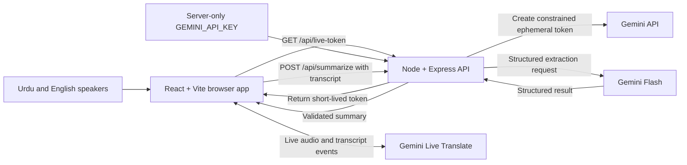
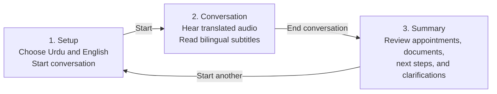
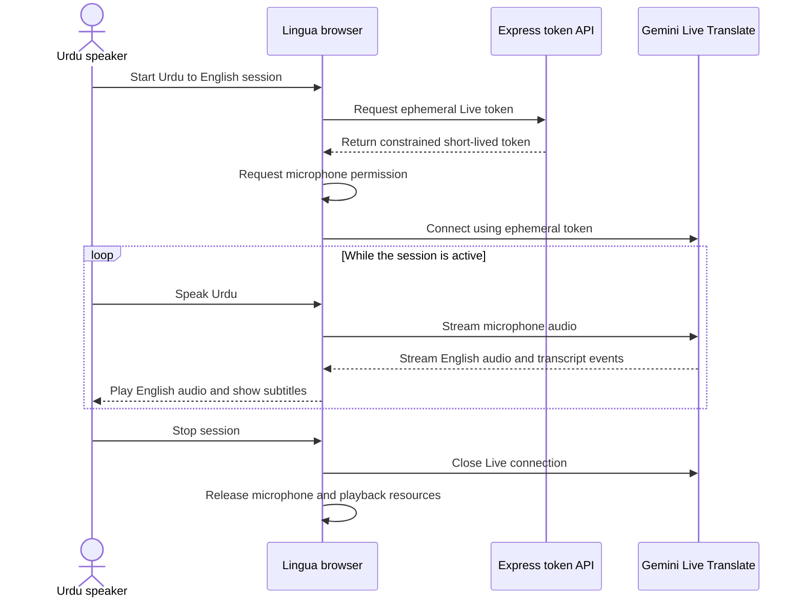
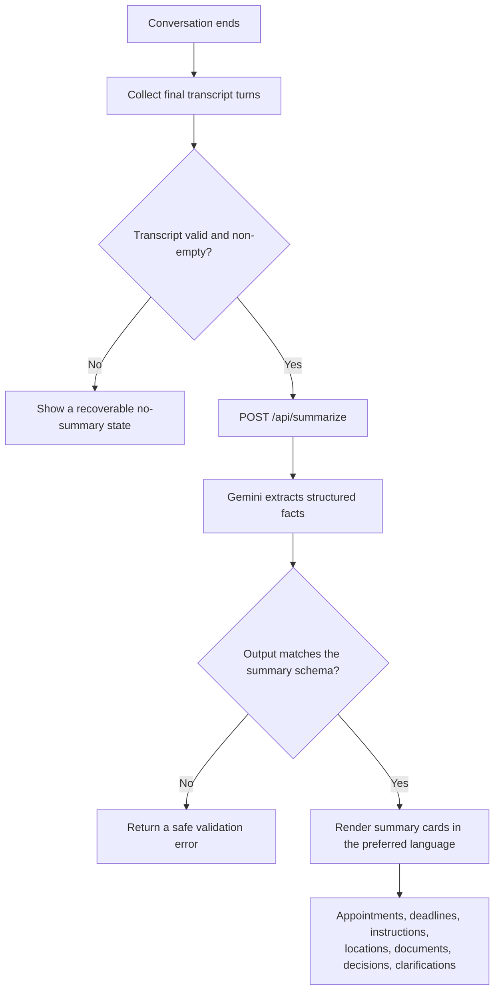
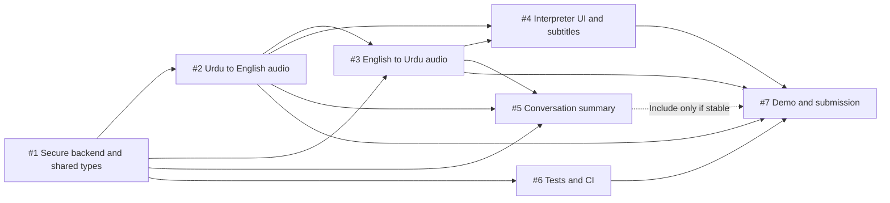

# Lingua Architecture and Flows

These diagrams describe the hackathon MVP: one laptop translates spoken Urdu and English in both directions, displays bilingual subtitles, and optionally produces a structured summary when the conversation ends.

## System architecture and secure token flow

The browser never receives the long-lived `GEMINI_API_KEY`. It asks the server for a constrained, short-lived token and uses that token for the direct Live API connection.

## Three-screen user journey

## Live translation sequence

The same sequence is reused with the languages reversed for English to Urdu.

## End-of-conversation summary flow

## Issue dependency map

Issues #2 and #4 can begin against mocks while #1 is in progress, but their final integration depends on the secure backend and shared contracts from #1.

